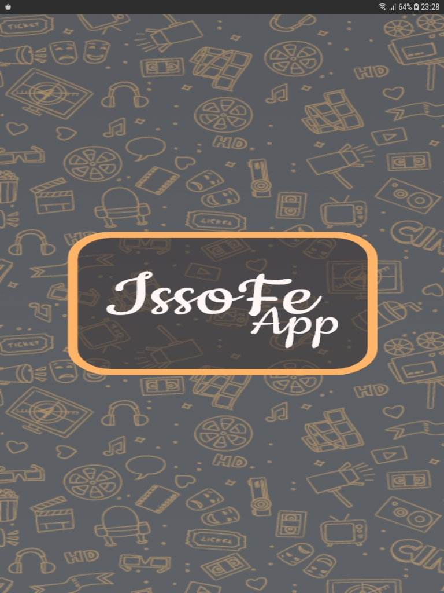
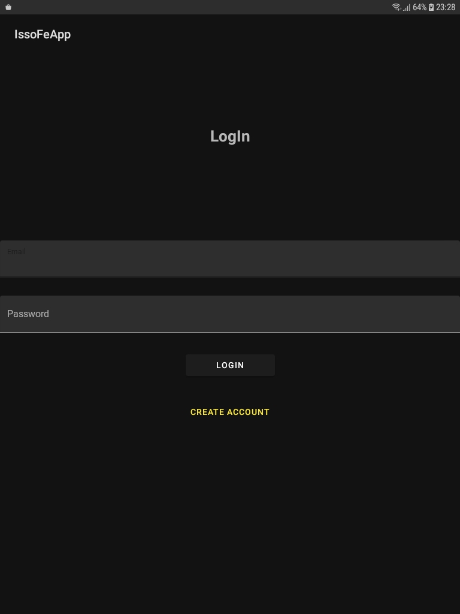
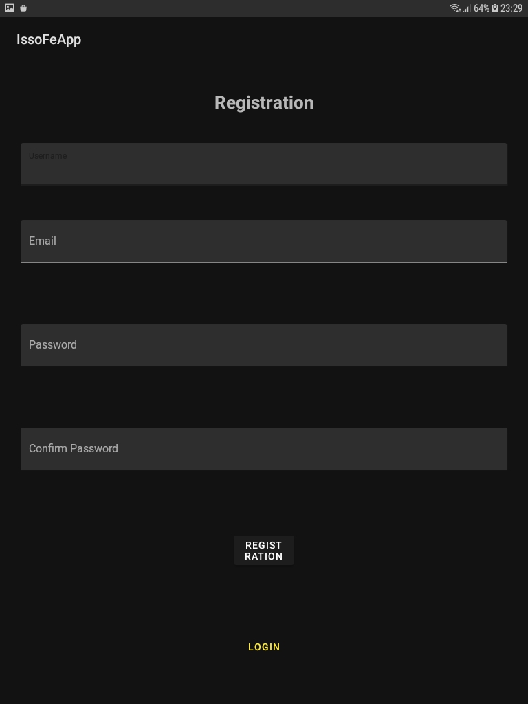
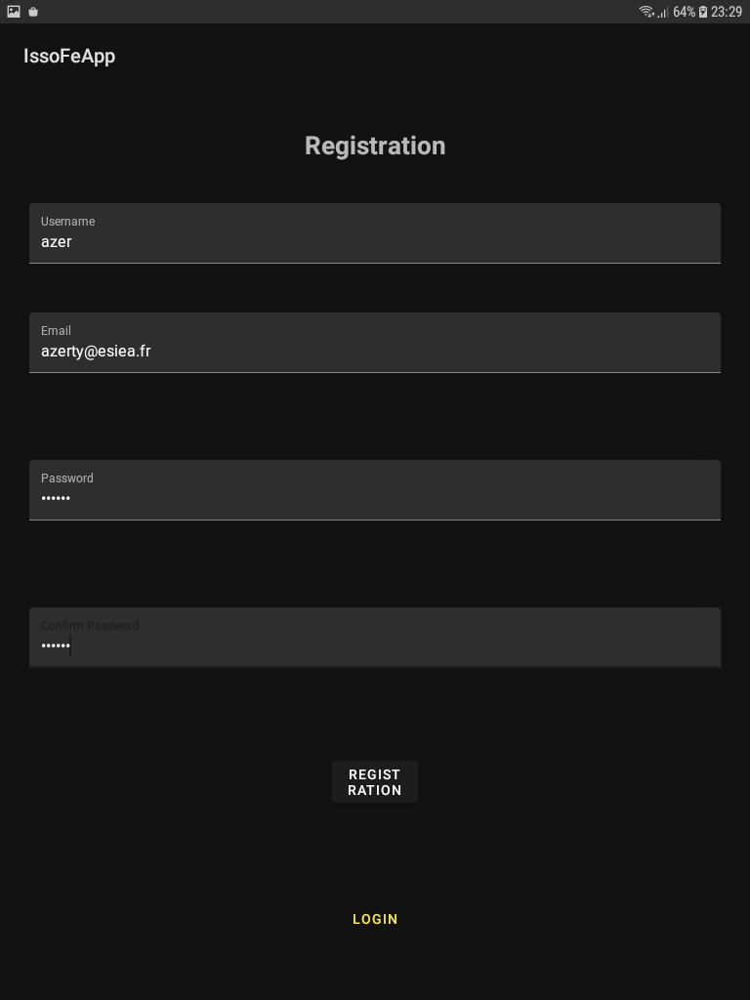
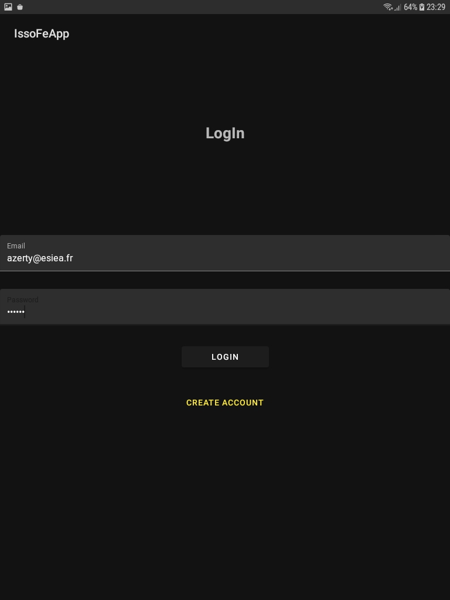
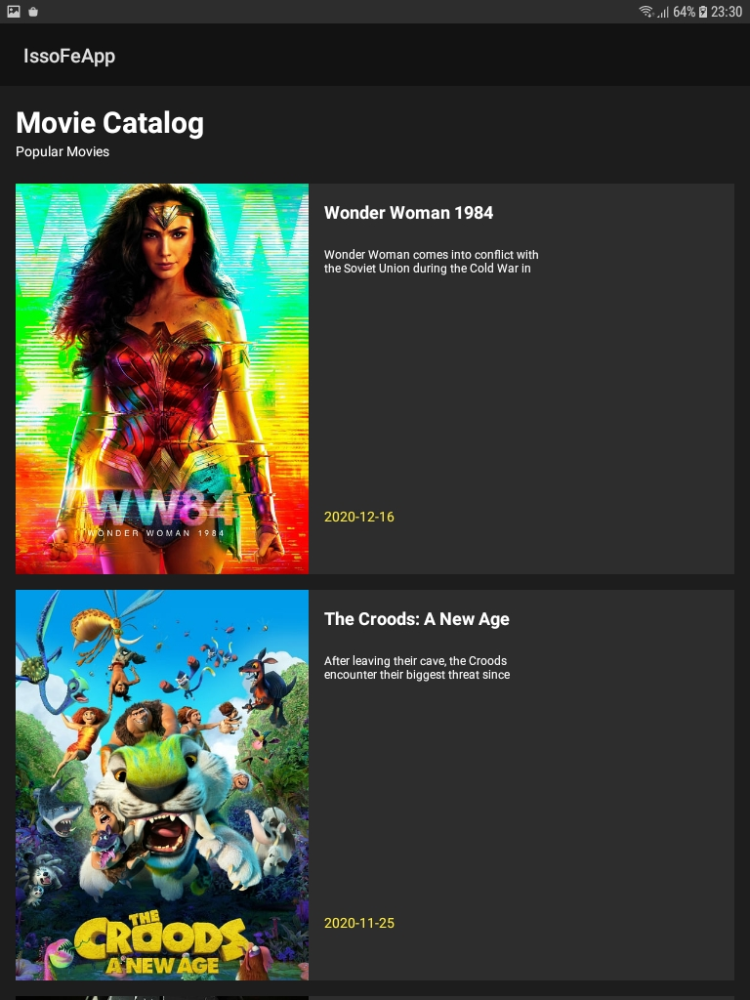

# IssoFeApp
### Mobile Programming project (4A)

IssoFeApp is a mobile application that shows the popular movies from the <a href="https://fr.wikipedia.org/wiki/Interface_de_programmation">API</a> <strong><a href="https://developers.themoviedb.org/3/getting-started/introduction">TMDB</a></strong>

It is a project that allowed me to learn how to create a mobile application with <strong>Kotlin</strong> language.

# Technical Stack

Kotlin, Room, Koin, Retrofit, Glide, Coroutines, Mockk, RecyclerView

# Goal of the project
<ul>
    <li>MVVM Architecture</li>
    <li>Clean Architecture</li>
    <li>Room Database</li>
    <li>Api REST</li>
    <li>Display of a list</li>
    <li>Design</li>
</ul>

# Screenshot of the application

    
    
    

    
    
    

